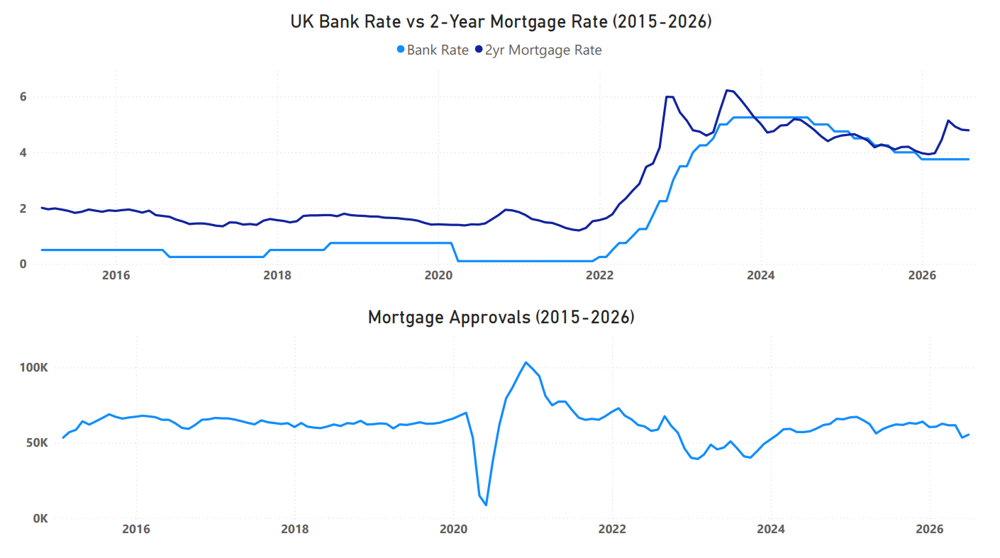
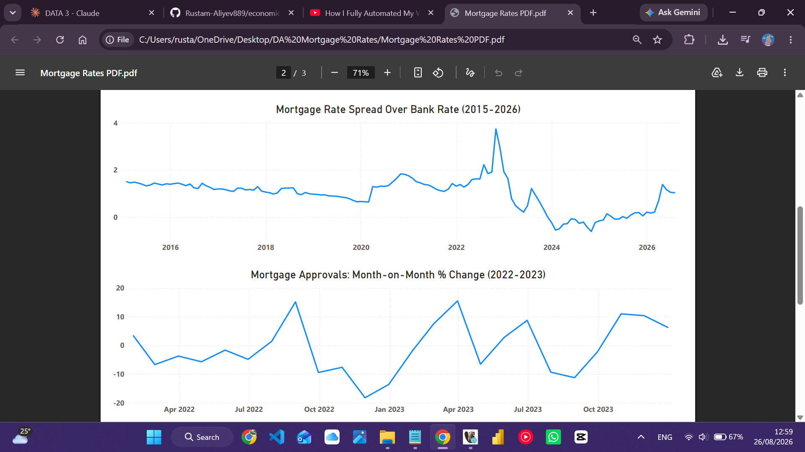
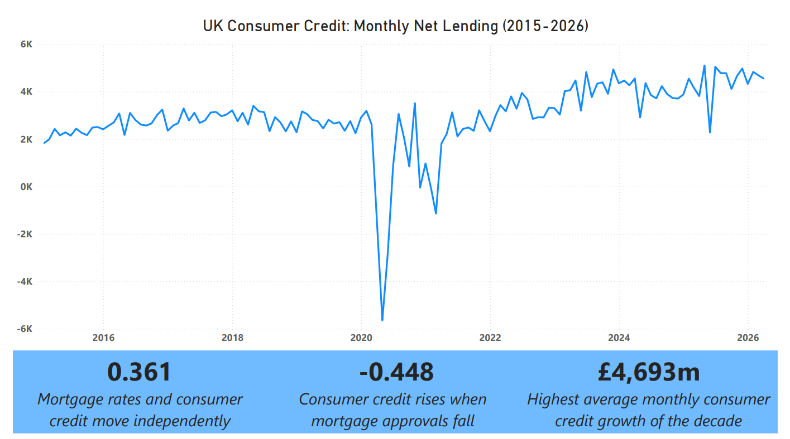

# UK Mortgage & Rate Market Analysis

Analysis of UK borrowing costs from 2015 to 2026, examining how mortgage rates actually respond to Bank of England policy, and what happened when that relationship broke down in 2022.

## Goal

Mortgage rates are commonly assumed to move in step with the Bank of England's base rate — cut the base rate, mortgages get cheaper; raise it, they get more expensive. This project tests that assumption against the data, and looks at what actually happened when UK borrowing costs went through their sharpest shock in over a decade: did mortgage rates simply follow the base rate, did the housing market freeze up, and did people quietly switch to other forms of borrowing when mortgages became unaffordable.

## The Data

- **Source:** Bank of England Statistical Database
- **Scope:** Four series, 2015–2026 — fixed mortgage rates (2/3/5/10yr), Bank Rate, mortgage approvals for house purchase, and consumer credit net lending

**Issues in the raw data:**
- Two series codes pulled from indirect references turned out to be wrong: an initial "consumer credit" download was actually total lending to individuals (a figure roughly 10x too large), and a "mortgage approvals" download was actually a technical residual series with values in the hundreds, not the expected tens of thousands. Both were caught by cross-checking against published Bank of England release figures before they made it into the database.
- Bank Rate publishes daily; the other three series publish monthly — resampling was needed before the series could be joined.
- On import, PostgreSQL/DBeaver auto-created new columns from the CSV headers instead of populating the pre-built schema, silently leaving the intended columns empty across all four tables.
- Two tables carried a stray blank row from the CSV export, with a null date.

## Data Cleaning

Loaded into PostgreSQL, tables built manually, then cleaned in DBeaver:

1. Verified all four series against published Bank of England figures before use, replacing the two incorrect series with the correct ones
2. Fixed the column-import mismatch by dropping the empty pre-built columns and renaming the auto-generated ones into the intended schema
3. Removed the stray null-date rows from the approvals and consumer credit tables
4. Resampled Bank Rate from daily to monthly, using the latest value on or before each month-end date, so it could be joined against the other three monthly series

Example, resampling a daily series to monthly:
```sql
CREATE TABLE bank_rate_monthly AS
SELECT
    mr.date,
    (
        SELECT br.bank_rate
        FROM bank_rate br
        WHERE br.date <= mr.date
        ORDER BY br.date DESC
        LIMIT 1
    ) AS bank_rate
FROM mortgage_rates mr
ORDER BY mr.date;
```

Example, flagging months where mortgage rates decoupled from the Bank Rate:
```sql
SELECT
    date,
    bank_rate,
    rate_2yr,
    rate_2yr - bank_rate AS spread_2yr,
    CASE
        WHEN ABS((rate_2yr - bank_rate) - LAG(rate_2yr - bank_rate) OVER (ORDER BY date)) > 0.5
        THEN 'Decoupling event'
        ELSE NULL
    END AS flag
FROM monthly_combined
ORDER BY date;
```

**Skills used:** data validation against external sources, data cleaning, resampling/frequency conversion, window functions, correlation analysis, SQL aggregation, dashboard design

**Tools:** PostgreSQL, DBeaver, Power BI

## Findings

### 1. Mortgage Rates Don't Move in Lockstep With the Bank Rate

If mortgage pricing simply tracked the base rate, the gap between them ("the spread") should stay roughly constant. It does not. This section checks how stable that relationship actually is, and where it breaks down.

The spread swung from as low as -0.60 percentage points (late 2024, mortgage rates briefly sitting *below* the base rate) to as high as 3.74 percentage points (October 2022) — a range of over 4 points across the dataset. Flagging every month where the spread moved by more than 0.5 points turns up 9 "decoupling events" in total, and 4 of them fall in 2022 alone.

| Month | Bank Rate | 2yr Mortgage Rate | Spread | Context |
|---|---|---|---|---|
| Oct 2022 | 2.25 | 5.99 | 3.74 | Peak of mini-budget/gilt crisis |
| Nov 2022 | 3.00 | 5.98 | 2.98 | Crisis starting to unwind |
| Jul 2023 | 5.00 | 6.22 | 1.22 | Second, smaller 2023 spike |
| Apr 2026 | 3.75 | 5.14 | 1.39 | Bank Rate held flat, mortgage rates jumped anyway |

Mortgage rates are pricing in where the market expects policy to go, not just where it currently sits. The 2026 episode makes this clearest: the Bank Rate hadn't moved at all, yet mortgage rates jumped over a full percentage point in a single month, driven by swap-rate expectations tied to global energy prices rather than any actual Bank of England decision.



### 2. The 2022 Shock Nearly Halved the Housing Market — With a Delay

If buyers reacted to rates instantly, the approvals crash should line up exactly with the rate spike. It doesn't quite. This section checks the timing and scale of the market's reaction.

Mortgage approvals fell 46% from January 2022 (72,943) to January 2023 (39,238). The single worst month was November 2022, down 18.2%, which lands about a month *after* rates actually peaked in October 2022 — consistent with a lag between rates rising and buyers/lenders reacting, rather than an instant response.

| Month | 2yr Rate | Approvals | MoM Change |
|---|---|---|---|
| Oct 2022 | 5.99 | 56,588 | -7.6% |
| Nov 2022 | 5.98 | 46,280 | **-18.2%** |
| Dec 2022 | 5.43 | 39,985 | -13.6% |

By December 2023, approvals had recovered to 52,209 — even though the 2-year rate was still around 5%, more than triple where it started 2022. The market found a new, lower equilibrium and kept moving rather than staying frozen at the crisis low.



### 3. Consumer Credit Didn't Collapse Alongside the Mortgage Market

If people were priced out of mortgages and had nowhere else to turn, unsecured borrowing might be expected to swing sharply against approvals. The actual relationship is real, but modest.

Consumer credit net lending stayed positive throughout the crisis — it never dropped below roughly £2,900m/month, even as approvals nearly halved. The correlation between approvals and consumer credit sits at -0.448 (moderate), and between mortgage rates and consumer credit at 0.361 (weak-to-moderate positive) — both point in the direction of some substitution, but neither is strong enough to call it a dominant effect.

| Relationship | Correlation | Read |
|---|---|---|
| Mortgage rate vs. consumer credit | 0.361 | Weak-to-moderate — credit kept growing even as rates rose |
| Approvals vs. consumer credit | -0.448 | Moderate — credit tended to rise as approvals fell |

The 2022 shock was concentrated in the mortgage market specifically. Consumer credit acted as a partial shock absorber, not a place where the crisis relocated to.



### 4. 2026 Isn't "Back to Normal" — It's Something New

A recovery from the 2022 shock could mean a full return to pre-crisis conditions, or it could mean settling into a new, different normal. Comparing 2026 against every other year in the dataset answers which one this is.

| Year | Avg Bank Rate | Avg 2yr Rate | Avg Approvals | Avg Net Lending |
|---|---|---|---|---|
| 2019 | 0.75 | 1.59 | 62,884 | 2,722 |
| 2022 | 1.54 | 3.50 | 59,797 | 3,298 |
| 2023 | 4.73 | 5.31 | 45,560 | 4,108 |
| 2026* | 3.75 | 4.57 | 59,221 | **4,693** |

*2026 covers January–July only.

Rates have cooled from their 2023-2024 peak but remain roughly 2-3x the 2015-2021 average. Approvals in 2026 sit below every single pre-2022 year. Consumer credit tells the opposite story: 2026's average net lending is the highest of the entire dataset, higher even than the 2023 crisis peak, and it has climbed every year since 2020 regardless of what rates or approvals were doing.

## Conclusion

Mortgage rates are not simply "Bank Rate plus a fixed margin" — the spread between them is a live signal of market expectations, and it widens most sharply exactly when those expectations get shaken, as in 2022 and again, more mildly, in 2026. The 2022 shock hit the mortgage market hard and fast, but the market adapted faster than rates recovered, and the crisis stayed largely contained to mortgages rather than spilling broadly into consumer credit. Where that leaves the UK now is not a return to the pre-2022 world: rates are lower than their peak but still historically elevated, the housing market is still running below its old baseline, and consumer borrowing is growing faster than at any other point in the last decade — a genuinely new equilibrium, not a return to an old one.